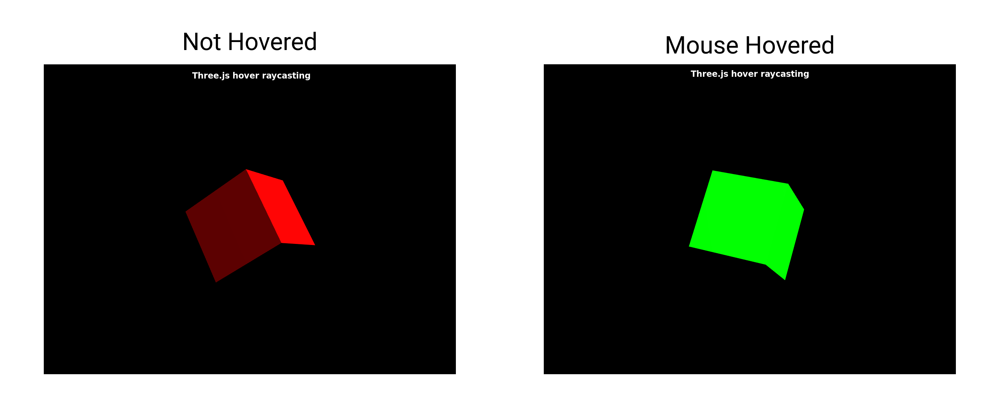

# Three.js Hover Raycasting

The `BoxBufferGeometry` mesh just turns _green_ when it is hovered upon by your mouse cursor, nothing fancy here.

This will help you setup [Ray Casting](https://en.wikipedia.org/wiki/Ray_casting) in your [three.js](http://threejs.org) app.

This project uses [Parcel](https://parceljs.org/) to bundle your files.

`yarn start` - Start dev server 

`yarn build` - Build bundle in `dist/`